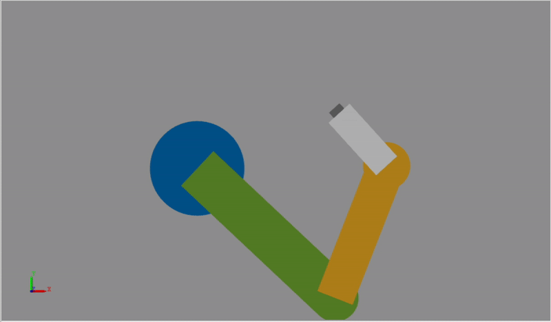
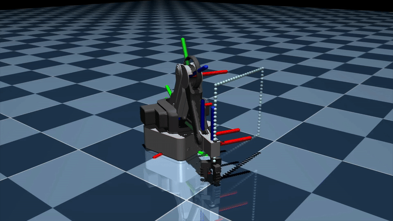
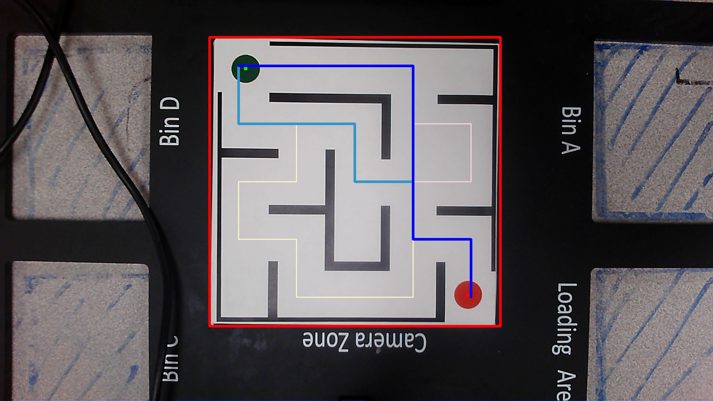

# Selected Results

## HW3 - FK & IK of SCARA Robot using MATLAB Simulink

    
    

## HW4 - Lagrangian Modeling of a Slider-Crank Mechanism

https://github.com/user-attachments/assets/85d1eca1-2030-4b17-a8a7-a1eae2f59c1d

## Lab2 - Inverse Kinematics of Magician Robot

    
    

## Lab3&4 - Trajectory Following with the Mycobot Pro 600

    
    

https://github.com/user-attachments/assets/1d5d7e17-7694-4bd6-b2e2-a776705b2996

## Lab5 - Solving Mazes with Mycobot

https://github.com/user-attachments/assets/c41f2a01-c2c9-49f1-b5ee-75950b784ab5
