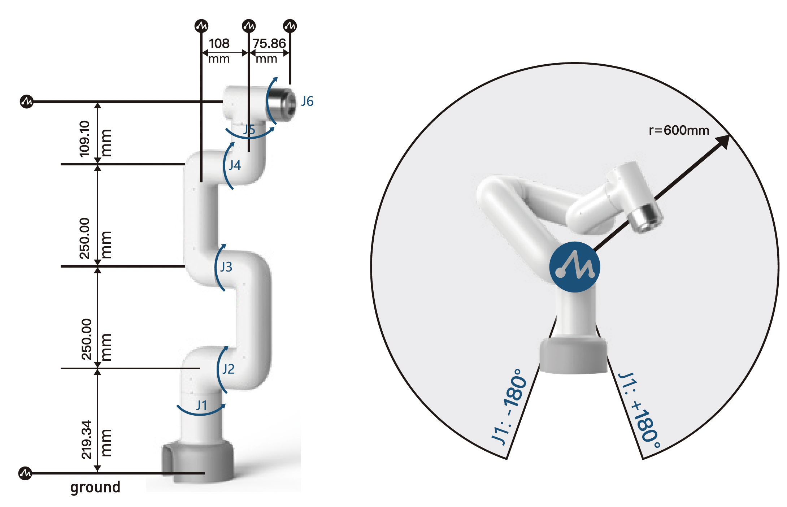
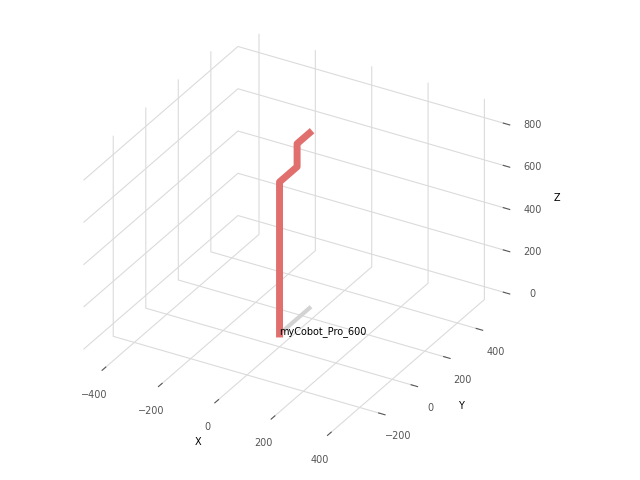

# Forward Kinematics of myCobot Pro 600





- Requirements:
    ```
    pip install roboticstoolbox-python
    ```
        
- D-H parameters:
    | Joint | θ | d | a | α |
    |-------|---|---|---|----|
    | 1-2 | θ1 | 219.34 | 0 | π/2 |
    | 2-3 | θ2 - π/2 | 0 | -250 | 0 |
    | 3-4 | θ3 | 0 | -250 | 0 |
    | 4-5 | θ4 + π/2 | -108 | 0 | -π/2 |
    | 5-6 | θ5 | 109.10 | 0 | π/2 |
    | 6-END | θ6 | -75.86 | 0 | π |

