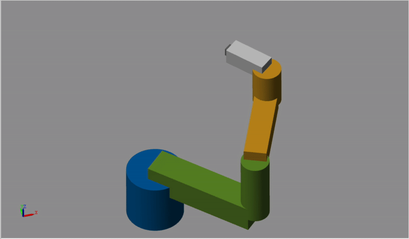

# Forward & Inverse Kinematics of SCARA Robot using MATLAB Simulink

- D-H parameters:
    | Joint | θ | d | a | α |
    |-------|---|---|---|----|
    | 1 | θ1 | 0.2 | 0.4 | 0 |
    | 2 | θ2 | 0.25 | 0.3 | 0 |
    | 3 | θ3 | 0.15 | 0.15 | 0 |

- Simulink Overview  

- Random movement  

- Moving a square trajectory

    
    

