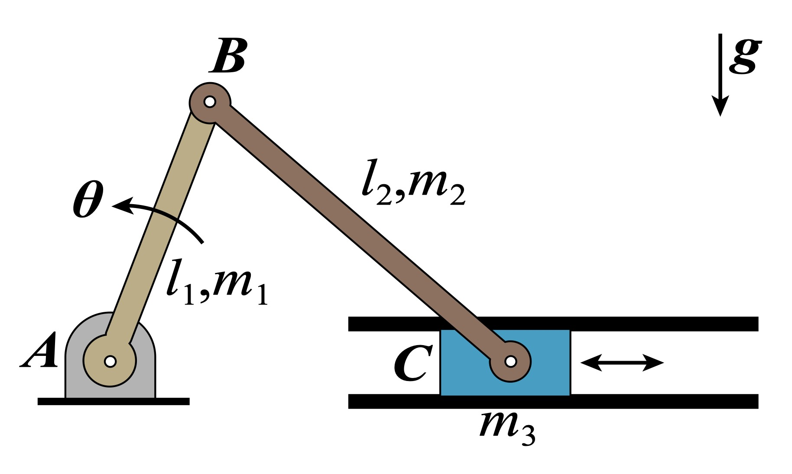

# Lagrangian Modeling of a Slider-Crank Mechanism

> modeled using the Lagrangian method, solved as an ODE in MATLAB, and visualized in MuJoCo.

https://github.com/user-attachments/assets/85d1eca1-2030-4b17-a8a7-a1eae2f59c1d