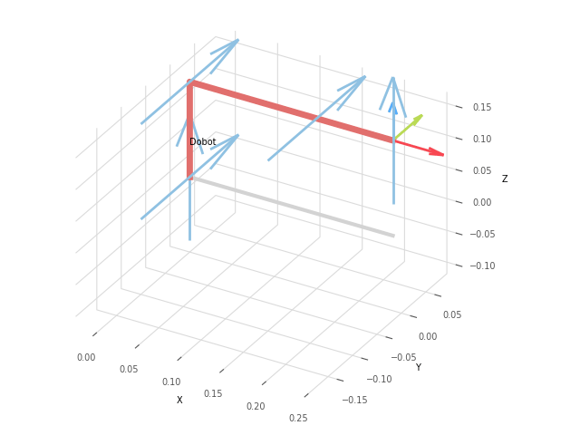

# Forward Kinematics of Dobot Magician Lite



- Requirements:
    ```
    pip install roboticstoolbox-python
    ```

- Run the script:
    ```
    python lab1_dobot_dh.py
    python lab1_dobot_dh_manual.py
    ```

- D-H parameters:
    | Joint | θ | d | a | α |
    |-------|---|---|---|----|
    | 1 | θ1 | 0 | 0 | -π/2 |
    | 2 | θ2 - π/2 | 0 | 0.15 | 0 |
    | 3 | θ3 + π/2 | 0 | 0.15 | 0 |
    | 4 | θ4 | 0 | 0.09 | π/2 |
    | 5 | θ5 | 0 | 0 | 0 |
