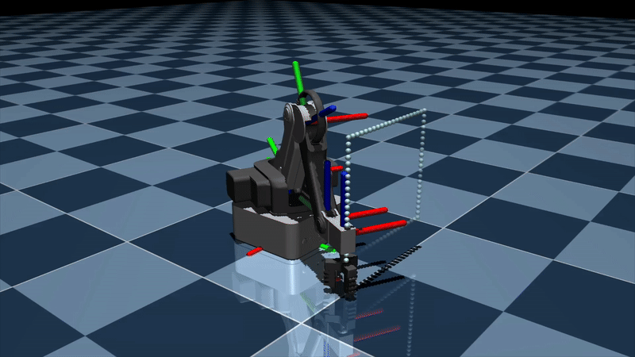
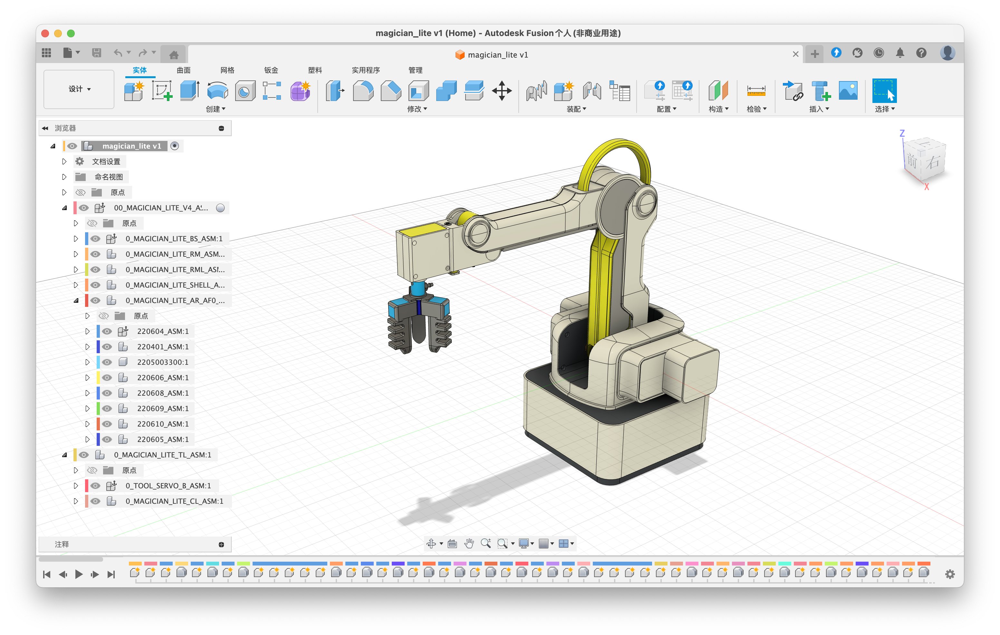
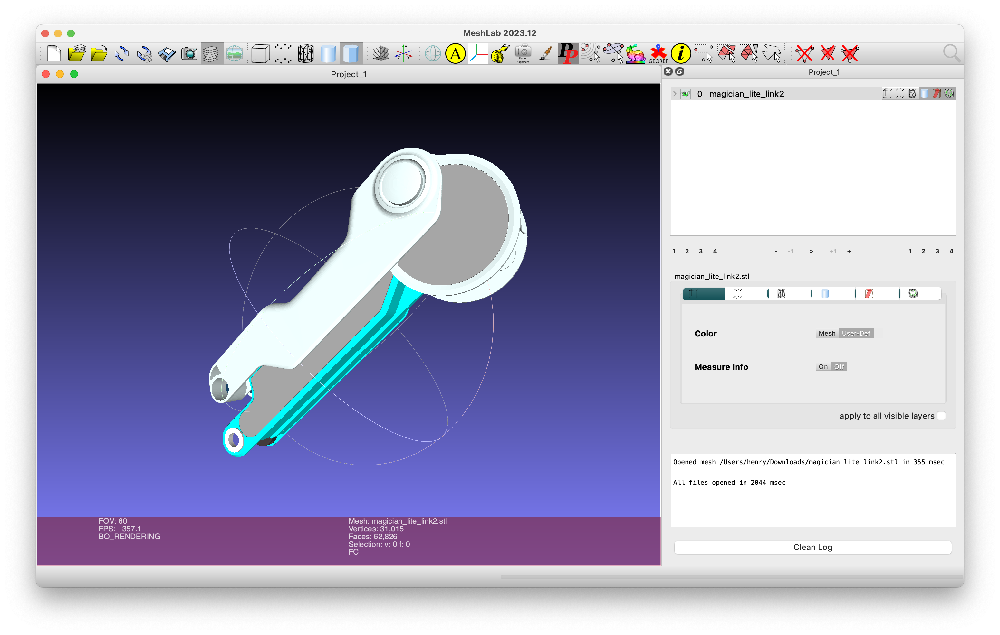
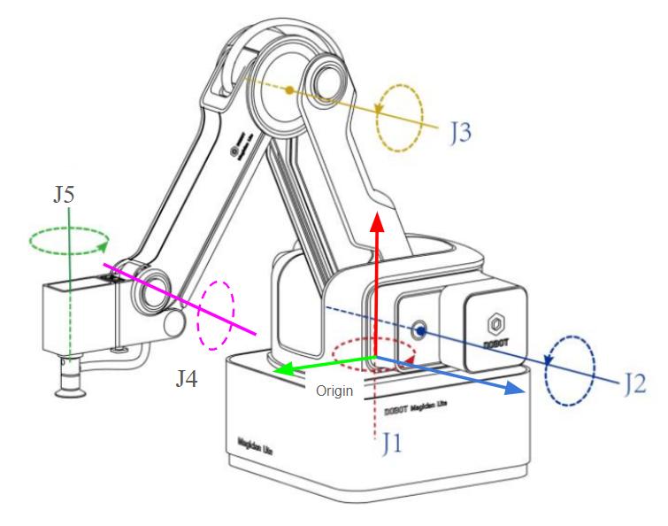
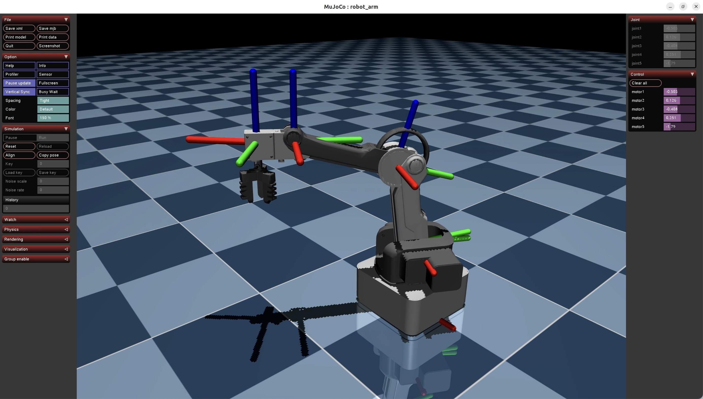

# Digital Twin for Magician Robot

<div style="display: flex; justify-content: space-between;">
    
    
</div>

## Simulate in MuJoCo
1. Use Fusion 360 to open stp file, decompose link (redundant parts removed), export stl;
    
2. Use MeshLab to import stl, simplify the number of faces, export _binary_ STL (which is required by MuJoCo XML file);
    
3. Use PyMJCF to modify the relative position, rotation, and joint configuration of the robot in the xml file.
    

It is important to note that the Magician robotic arm’s joint 3 actually has two rotational axes. However, for simplification, it has been represented as a single joint here, with appropriately adjusted D-H parameters to better match the visual representation. As a result, the kinematics may not fully correspond to the actual robot.




## Inverse Kinematics

The reason I did not use common IK toolboxes, such as `Pinocchio` or `ikpy`, is that the Magician robot has a dependent joint—specifically, the angle of joint 4 is mechanically determined and depends on joint 2 and joint 3. This is an unusual constraint that may not be handled by standard IK solutions.

### Obtain Analytical Solution using SymPy

> lab3_dobot_ik.py `dobot_ik_analytical()`

Using the D-H parameters obtained from lab1 and the base-to-end transformation matrix, the symbolic expression for the forward kinematics of the robotic arm can be derived. By treating joint angles as variables and setting constraints between them (including joint angle limits and coupling relationships), the symbolic solution for the inverse kinematics of the robotic arm can be obtained.

```python
from sympy import Eq, solve

equations = [
    Eq(px, target_px),
    Eq(py, target_py),
    Eq(pz, target_pz)
]

solutions = solve(equations, (theta1, theta2, theta3), dict=True)
```

However, the inverse kinematics equations are highly nonlinear and complex, especially in robotic arm models where multiple joint angles are involved. Each angle introduces sin and cos functions. Even after some simplifications—for example, pre-determining the angles of θ₁ and θ₅ through observation, treating θ₄ as a dependent variable, and only considering θ₂ and θ₃ as variables—SymPy’s solve function still struggles to efficiently find an analytical solution. In fact, I have never succeeded.


### Obtain Numerical Solution using Scipy

> lab3_dobot_ik.py `dobot_ik_numerical()`

By taking the difference between the target position and the transformation matrix expression as the minimization objective, and setting up the optimization constraints (joint angle limits and coupling relationships), the inverse kinematics numerical solution of the robotic arm can also be obtained using `scipy.optimize.minimize` to solve the optimization problem.

```python
from scipy.optimize import minimize

def objective(theta, target):
    theta1 = theta[0]
    theta2 = theta[1]
    theta3 = theta[2]
    px = (0.15*np.sin(theta2) + 0.15*np.cos(theta2 + theta3) + 0.09)*np.cos(theta1)
    py = (0.15*np.sin(theta2) + 0.15*np.cos(theta2 + theta3) + 0.09)*np.sin(theta1)
    pz = -0.15*np.sin(theta2 + theta3) + 0.15*np.cos(theta2)
    return (px - target[0])**2 + (py - target[1])**2 + (pz - target[2])**2

# add joint angle limits
bounds = [(-np.pi, np.pi), (-np.pi/4, np.pi/2), (-np.pi/3, np.pi/3)]
# solve optimization problem
result = minimize(objective, x0[:3], args=([x_target, y_target, z_target]), bounds=bounds)
```

Note that the initial guess (initial_guess) has a significant impact on the result, as there may be multiple solutions for the same target position. The initial guess determines which solution is selected.


### Generate Trajectory

This code implements two parametric shapes: a circle and a square. By interpolating along the path, a series of end-effector target positions are obtained. Then, the corresponding joint angles are calculated using the aforementioned numerical solution.

Note that the solution from the previous time step is always used as the initial value for the next time step to ensure smooth motion of the robotic arm.

The final result is shown in the animation at the beginning.
